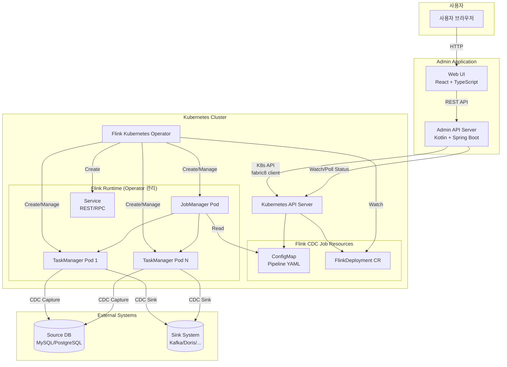
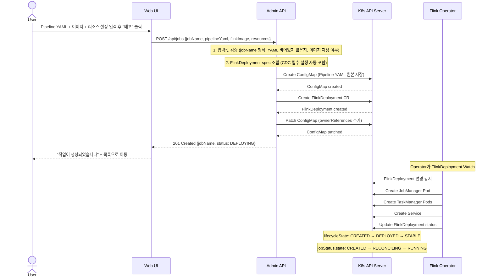
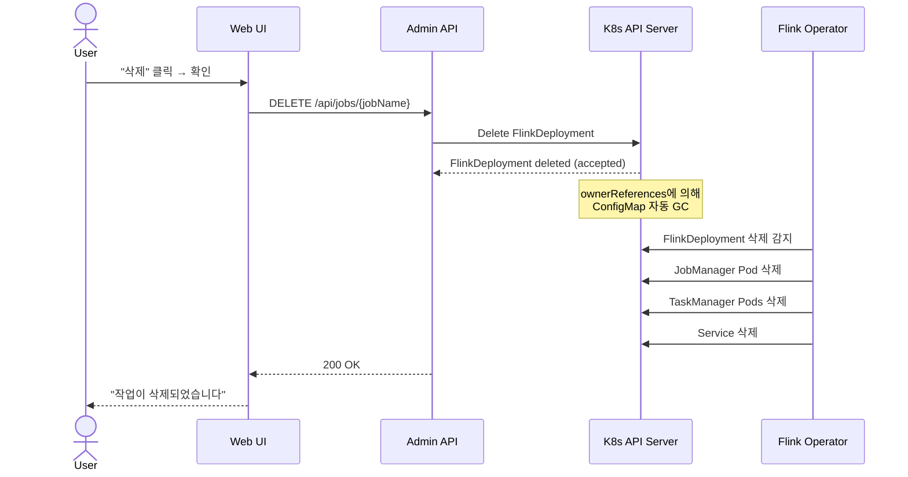
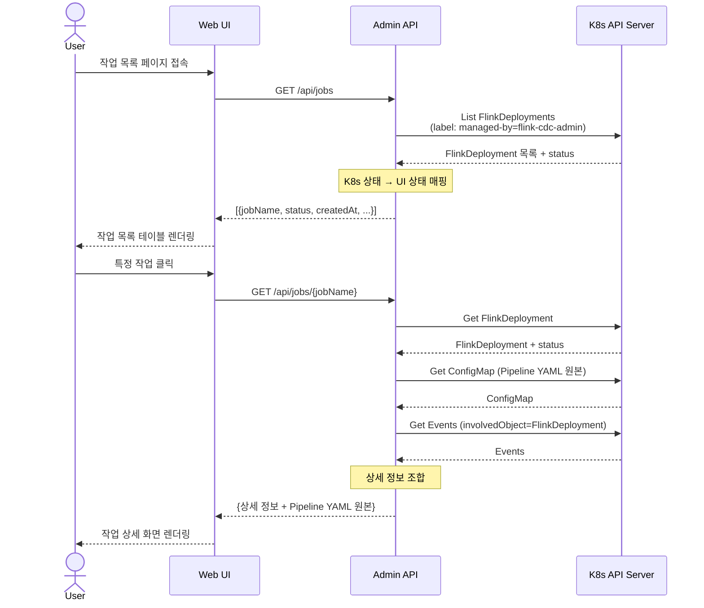

# Flink CDC Admin Tool – Architecture Document

---

## 1. 시스템 구성요소

### 1.1 구성요소 개요

| 구성요소 | 역할 | 비고 |
|---|---|---|
| **Web UI (Frontend)** | Pipeline YAML 입력, 이미지/리소스 설정, 작업 목록/상세 조회, 상태 표시 | React + TypeScript |
| **Admin API Server (Backend)** | 입력 검증, ConfigMap/FlinkDeployment 생성, K8s 리소스 CRUD, 상태 조회 | Kotlin + Spring Boot |
| **Kubernetes API Server** | K8s 리소스 관리의 중심. CR 생성/조회/삭제 처리 | 클러스터 내장 |
| **Flink Kubernetes Operator** | FlinkDeployment CR을 관찰하여 Flink 클러스터를 배포/관리 | 사전 설치 필수 |
| **Flink Cluster (JM/TM)** | 실제 Flink CDC 파이프라인 실행 | Operator가 생성 |
| **ConfigMap** | 사용자가 제공한 Pipeline YAML 저장 | Admin App이 생성 |
| **DB** | v0에서는 사용하지 않음. 향후 이력/감사 로그용 | 선택적 |

### 1.2 시스템 다이어그램



### 1.3 컴포넌트 간 통신 요약

```
User ──HTTP──▶ Web UI ──REST──▶ Admin API ──K8s API──▶ K8s API Server
                                                            │
                                                            ├── ConfigMap (CRUD)
                                                            ├── FlinkDeployment (CRUD)
                                                            └── Pod/Event/Service (Read)

Flink Operator ◀──Watch── K8s API Server ──▶ FlinkDeployment
       │
       ├── Create/Update JobManager Pod
       ├── Create/Update TaskManager Pods
       └── Create Service
```

---

## 2. 주요 흐름

### 2.1 생성 흐름 (Create)



#### Backend가 자동 처리하는 FlinkDeployment 설정

사용자는 Pipeline YAML, Docker 이미지, 리소스만 제공한다. 나머지 FlinkDeployment 세부 설정은 Backend가 자동으로 조립한다:

| 자동 설정 항목 | 값 | 이유 |
|---|---|---|
| `flinkConfiguration.classloader.resolve-order` | `parent-first` | Flink CDC 필수 설정 |
| `job.jarURI` | `local:///opt/flink/lib/flink-cdc-dist-*.jar` | CDC CLI 진입점 |
| `job.entryClass` | `org.apache.flink.cdc.cli.CliFrontend` | CDC CLI 메인 클래스 |
| `job.args` | `[/opt/flink/cdc-pipeline/pipeline.yaml]` | ConfigMap 마운트 경로 |
| `podTemplate` | volume + volumeMount 구성 | ConfigMap을 Pod에 마운트 |
| `metadata.labels` | `app.kubernetes.io/managed-by: flink-cdc-admin` | 리소스 식별 |
| `metadata.ownerReferences` | ConfigMap → FlinkDeployment | 리소스 생명주기 관리 |

#### 생성 흐름 상세 단계

| 단계 | 주체 | 동작 | 실패 시 처리 |
|---|---|---|---|
| 1 | UI | 입력값 클라이언트 검증 (jobName, YAML 비어있지 않은지, 이미지 필수) | 폼 에러 표시 |
| 2 | API | 입력값 서버 검증 (jobName 형식, YAML 문자열 유효성) | 400 Bad Request 반환 |
| 3 | API | ConfigMap 생성 (사용자 Pipeline YAML 원본 저장) | 에러 반환, 정리 불필요 |
| 4 | API | FlinkDeployment CR 생성 (CDC 필수 설정 자동 포함) | ConfigMap 정리 후 에러 반환 |
| 5 | API | ConfigMap에 ownerRef 패치 | 경고 로그. 삭제 시 수동 정리 필요할 수 있음 |
| 6 | Operator | JM/TM Pod 생성 및 Job 시작 | Operator가 재시도. status에 에러 반영 |

### 2.2 삭제 흐름 (Delete)



#### 삭제 흐름 상세

1. **Admin API**가 FlinkDeployment를 삭제한다.
2. **Kubernetes GC**가 ownerReferences를 따라 ConfigMap을 자동 삭제한다.
3. **Operator**가 FlinkDeployment 삭제를 감지하고 관련 Pod/Service를 정리한다.
4. ownerReferences가 정상 설정되지 않은 경우를 대비하여, Admin API는 label selector(`app.kubernetes.io/managed-by=flink-cdc-admin, app.kubernetes.io/name={jobName}`)로 남은 리소스를 확인하고 정리하는 보조 로직을 가진다.

### 2.3 상태 조회 흐름 (Read)



---

## 3. 상태 조회 전략 비교

### 3.1 선택지

| 전략 | 방식 | 장점 | 단점 |
|---|---|---|---|
| **A. Polling** | 주기적 GET 요청 (예: 5초 간격) | 구현 단순, 상태 비저장 | 네트워크/API Server 부하, 지연 |
| **B. Watch/Informer** | K8s Watch API로 실시간 이벤트 수신 | 실시간, 효율적 | 연결 관리 복잡, 상태 캐시 필요 |
| **C. Operator Status 기반** | FlinkDeployment `.status` 필드 읽기 | 데이터 풍부, Operator가 관리 | Operator 의존 |
| **D. Flink REST API 기반** | JobManager REST API 직접 호출 | 가장 상세한 Job 정보 | JM 접근 필요, JM 없으면 불가 |

### 3.2 추천안: Operator Status 기반 Polling (v0) → Watch/Informer (v1)

**v0 추천: Operator Status 기반 + Polling**

```
UI ──(5초 간격)──▶ Admin API ──GET──▶ K8s API ──▶ FlinkDeployment.status
```

선택 근거:
1. **구현 단순성**: Polling은 상태 비저장이므로 Admin API의 복잡도를 최소화한다.
2. **데이터 충분성**: FlinkDeployment `.status`에는 `lifecycleState`, `jobStatus`, `jobManagerDeploymentStatus`, `error` 등 UI에 필요한 대부분의 정보가 포함되어 있다.
3. **안정성**: Watch 연결이 끊어지는 엣지 케이스를 고려하지 않아도 된다.
4. **적절한 지연**: 5초 간격 polling은 관리 도구 수준에서 허용 가능한 지연이다.

**v1 확장 방향: Informer 기반 캐시**

- fabric8 client의 `SharedIndexInformer`를 활용하여 FlinkDeployment 변경을 실시간으로 캐시.
- API 호출 시 캐시에서 즉시 응답 → API Server 부하 감소.
- WebSocket/SSE를 통해 UI에 실시간 상태 푸시 가능.

### 3.3 Flink REST API 보조 활용

Flink REST API는 주된 상태 소스가 아니라, 상세 화면에서 보조적으로 활용한다:

| 용도 | Flink REST 엔드포인트 | 비고 |
|---|---|---|
| Flink Web UI 링크 | JobManager Service URL | v0 지원 |
| Job 메트릭 | `/jobs/:jobId/metrics` | Future |
| Checkpoint 정보 | `/jobs/:jobId/checkpoints` | Future (Restore용) |

---

## 4. 데이터 저장소 전략

### 4.1 선택지 비교

| 전략 | 설명 | 장점 | 단점 |
|---|---|---|---|
| **A. K8s as Source of Truth** | FlinkDeployment + ConfigMap 자체가 데이터 소스. 별도 DB 없음. | 단일 소스, 동기화 불필요, 인프라 최소 | 검색/필터 제한, 이력 관리 어려움, K8s API 부하 |
| **B. 별도 DB 사용** | PostgreSQL 등에 작업 메타데이터 저장. K8s 리소스와 동기화. | 빠른 조회, 이력 관리, 복잡한 쿼리 | 동기화 복잡성, 불일치 가능, 인프라 추가 |
| **C. 하이브리드** | K8s가 Source of Truth, DB는 캐시/이력용 읽기 전용 저장소. | 양쪽 장점 | 구현 복잡도 중간 |

### 4.2 v0 추천: K8s as Source of Truth (전략 A)

선택 근거:

1. **단순성**: v0의 핵심 가치는 단순함이다. DB를 추가하면 스키마 관리, 마이그레이션, 동기화 로직이 필요하다.
2. **일관성 보장**: K8s 리소스 자체가 데이터 소스이므로 DB-K8s 간 불일치 문제가 원천적으로 없다.
3. **운영 부담 최소화**: 별도 데이터베이스 운영이 불필요하다.
4. **충분한 성능**: v0 규모(수십~수백 작업)에서 K8s API 조회 성능은 충분하다.
5. **Pipeline YAML 보존**: ConfigMap에 저장된 원본 YAML을 상세 화면에서 바로 조회 가능.

제한 사항 및 완화:
- **검색/필터**: Label selector를 활용하여 기본적인 필터링 지원.
- **이력 관리**: K8s Events와 annotation으로 최소한의 이력 추적. 삭제된 작업의 이력은 유지되지 않음.
- **성능**: Informer 도입(v1)으로 K8s API 부하 완화.

### 4.3 v1 확장: 하이브리드 전략 (전략 C)

작업 수가 증가하거나 이력/감사 로그가 필요해지면:
- K8s 리소스는 여전히 Source of Truth (운영 상태).
- DB는 이력, 감사 로그, 삭제된 작업 기록 등 보조 데이터 저장.
- Informer 이벤트를 DB에 비동기로 기록.

---

## 5. 멱등성 및 오류 처리

### 5.1 중복 생성 요청

| 시나리오 | 처리 방식 |
|---|---|
| 동일 `jobName`으로 재요청 | K8s API가 `AlreadyExists` 에러 반환 → Admin API가 409 Conflict 반환 |
| UI 더블 클릭 | 프론트엔드에서 버튼 비활성화 + 백엔드 멱등성 보장 |
| 동시 요청 (race condition) | K8s API의 낙관적 동시성 제어(resourceVersion)에 의존 |

구현:
```
POST /api/jobs → 동일 jobName 존재 시 409 Conflict
```
Admin API는 생성 전 FlinkDeployment 존재 여부를 확인하는 것이 아니라, K8s API에 직접 생성 요청을 보내고 `AlreadyExists` 에러를 핸들링한다 (check-then-act 패턴의 race condition 방지).

### 5.2 네트워크 오류

| 구간 | 오류 유형 | 처리 |
|---|---|---|
| UI → Admin API | HTTP 타임아웃 | 프론트엔드 재시도 + 폴링으로 실제 생성 여부 확인 |
| Admin API → K8s API | 일시적 연결 실패 | 지수 백오프 재시도 (최대 3회, 1s/2s/4s) |
| Admin API → K8s API | 타임아웃 | 동일 리소스 GET으로 생성 여부 확인 후 판단 |

### 5.3 부분 생성 실패

생성 흐름의 순서: ConfigMap → FlinkDeployment → ownerRef 패치

| 실패 지점 | 정리 전략 |
|---|---|
| ConfigMap 생성 실패 | 정리 불필요. 에러 반환. |
| FlinkDeployment 생성 실패 | 생성된 ConfigMap 삭제 후 에러 반환. |
| ownerRef 패치 실패 | 경고 로그. FlinkDeployment는 성공적으로 생성됨. ownerRef 없이도 동작하나, 삭제 시 수동 정리 필요. 백그라운드 재시도. |

```
생성 흐름 (의사 코드):

try:
    cm = createConfigMap(pipelineYaml)
    try:
        fd = createFlinkDeployment(spec, cm)
        try:
            patchOwnerRef(cm, fd)
        catch:
            log.warn("ownerRef 패치 실패, 수동 정리 필요할 수 있음")
            // FlinkDeployment 생성은 성공이므로 에러를 전파하지 않음
    catch:
        deleteConfigMap(cm)
        throw
catch:
    throw  // 클라이언트에 에러 반환
```

### 5.4 재시도 전략

| 대상 | 재시도 여부 | 전략 |
|---|---|---|
| K8s API 일시적 오류 (5xx, timeout) | O | 지수 백오프, 최대 3회 |
| K8s API 영구적 오류 (4xx) | X | 즉시 에러 반환 |
| Operator 처리 실패 | 해당 없음 | Operator 자체 재시도 메커니즘에 위임 |
| 정리 작업 (rollback delete) | O | 최대 2회 재시도 후 경고 로그 |

---

## 6. 네임스페이스 전략

### 6.1 선택지 비교

| 전략 | 설명 | 장점 | 단점 |
|---|---|---|---|
| **A. 단일 네임스페이스** | 모든 작업을 하나의 네임스페이스에 배포 (예: `flink-jobs`) | 단순, RBAC 최소 | 리소스 격리 없음, 이름 충돌 가능 |
| **B. 작업별 네임스페이스** | 작업마다 전용 네임스페이스 생성 | 완전한 격리, ResourceQuota 적용 가능 | 네임스페이스 관리 부담, Operator 설정 필요 |
| **C. 논리적 그룹별 네임스페이스** | 팀/환경별 네임스페이스 (예: `flink-team-a`, `flink-prod`) | 적절한 격리, 관리 가능 | 그룹 정의 필요, 중간 복잡도 |

### 6.2 추천안: 단일 네임스페이스 (전략 A) for v0

선택 근거:

1. **v0 단순성**: 네임스페이스 생성/관리 로직 불필요.
2. **Operator 설정 최소화**: Operator의 watch namespace를 하나로 고정.
3. **RBAC 단순화**: Admin App의 Role 하나로 충분.
4. **이름 충돌 방지**: `jobName` 유니크 제약으로 충분히 대응.

설정:
```yaml
# Admin App 설정
flink-cdc-admin:
  kubernetes:
    namespace: flink-jobs  # 기본 네임스페이스 (설정 가능)
```

### 6.3 v1 확장 방향

- UI에서 네임스페이스를 선택할 수 있도록 확장.
- Admin App의 RBAC을 ClusterRole로 확장하거나, 네임스페이스별 Role을 동적 생성.
- Operator가 복수 네임스페이스를 watch하도록 설정.

---

## 7. 리소스 정리 전략

### 7.1 ownerReferences 사용

**사용한다** (추천).

FlinkDeployment를 owner로 하여 ConfigMap에 ownerReferences를 설정한다.

```yaml
# ConfigMap
metadata:
  ownerReferences:
    - apiVersion: flink.apache.org/v1beta1
      kind: FlinkDeployment
      name: mysql-to-kafka-orders
      uid: "abc-123-..."
      controller: true
      blockOwnerDeletion: true
```

효과:
- FlinkDeployment 삭제 → Kubernetes GC가 ConfigMap 자동 삭제.
- 별도 정리 로직 최소화.
- "orphan" 리소스 방지.

### 7.2 Finalizer 필요 여부

**v0에서는 사용하지 않는다.**

| 관점 | 판단 |
|---|---|
| FlinkDeployment에 finalizer 추가 | 불필요. Operator가 자체 finalizer로 Pod/Service 정리 수행. |
| Admin App 자체 finalizer | 불필요. ownerReferences로 충분. |

Finalizer가 필요해지는 시점:
- 외부 시스템 정리가 필요한 경우 (예: 외부 DB에 이력 기록)
- 삭제 전 savepoint 자동 생성이 필요한 경우 (Future Scope)

### 7.3 보조 정리 메커니즘

ownerReferences 설정 실패 등 엣지 케이스를 대비한 보조 정리:

```
Label selector 기반 정리:

app.kubernetes.io/managed-by=flink-cdc-admin
app.kubernetes.io/name={jobName}
```

삭제 API에서:
1. FlinkDeployment 삭제 (primary).
2. Label selector로 관련 ConfigMap 조회.
3. ownerReferences에 의해 이미 삭제 진행 중이면 무시.
4. 남아있는 리소스가 있으면 명시적 삭제.

---

## 8. API 설계

### 8.1 v0 REST API

```
Base URL: /api/v1
```

| Method | Path | 설명 | 요청 | 응답 |
|---|---|---|---|---|
| `POST` | `/jobs` | 작업 생성 | CreateJobRequest | 201 + JobDetail |
| `GET` | `/jobs` | 작업 목록 조회 | Query: namespace, status | 200 + JobSummary[] |
| `GET` | `/jobs/{jobName}` | 작업 상세 조회 | — | 200 + JobDetail |
| `DELETE` | `/jobs/{jobName}` | 작업 삭제 | — | 200 + {message} |

### 8.2 요청/응답 모델

#### CreateJobRequest

```json
{
  "jobName": "mysql-to-kafka-orders",
  "pipelineYaml": "source:\n  type: mysql\n  hostname: mysql.prod.svc\n  port: 3306\n  username: cdc_user\n  password: secret\n  tables: app_db.\\.*\n  server-id: 5400-5404\nsink:\n  type: kafka\n  properties.bootstrap.servers: kafka:9092\nroute:\n  - source-table: app_db.orders\n    sink-table: orders-topic\npipeline:\n  name: mysql-to-kafka-orders\n  parallelism: 2",
  "flinkImage": "my-registry/flink-cdc:3.3.0-mysql-kafka",
  "resources": {
    "jobManager": { "cpu": 1, "memory": "1024m" },
    "taskManager": { "cpu": 1, "memory": "2048m", "replicas": 2 }
  },
  "parallelism": 2,
  "flink": {
    "version": "v1_18",
    "serviceAccount": "flink",
    "extraConfig": {}
  },
  "namespace": "flink-jobs"
}
```

#### JobSummary (목록 조회)

```json
{
  "jobName": "mysql-to-kafka-orders",
  "namespace": "flink-jobs",
  "status": "RUNNING",
  "flinkImage": "my-registry/flink-cdc:3.3.0-mysql-kafka",
  "createdAt": "2026-02-13T12:00:00Z",
  "parallelism": 2
}
```

#### JobDetail (상세 조회)

```json
{
  "jobName": "mysql-to-kafka-orders",
  "namespace": "flink-jobs",
  "status": "RUNNING",
  "flinkImage": "my-registry/flink-cdc:3.3.0-mysql-kafka",
  "createdAt": "2026-02-13T12:00:00Z",
  "pipelineYaml": "source:\n  type: mysql\n  ...",
  "resources": {
    "jobManager": { "cpu": 1, "memory": "1024m" },
    "taskManager": { "cpu": 1, "memory": "2048m", "replicas": 2 }
  },
  "parallelism": 2,
  "kubernetes": {
    "lifecycleState": "STABLE",
    "jobManagerDeploymentStatus": "READY",
    "jobStatus": {
      "state": "RUNNING",
      "jobId": "abc123def456",
      "startTime": "2026-02-13T12:01:30Z"
    },
    "error": null
  },
  "flinkUiUrl": "http://mysql-to-kafka-orders-rest.flink-jobs:8081",
  "events": [
    {
      "type": "Normal",
      "reason": "Submit",
      "message": "Job submitted successfully",
      "timestamp": "2026-02-13T12:01:00Z"
    }
  ]
}
```

### 8.3 Future API 확장

| Method | Path | 설명 | 도입 시점 |
|---|---|---|---|
| `POST` | `/jobs/{jobName}/savepoints` | Savepoint 생성 트리거 | v1 |
| `GET` | `/jobs/{jobName}/savepoints` | Savepoint 목록 조회 | v1 |
| `POST` | `/jobs/{jobName}/restore` | Savepoint/Checkpoint 복구 | v1 |
| `PUT` | `/jobs/{jobName}` | 작업 설정 업데이트 (Upgrade) | v2 |
| `POST` | `/jobs/{jobName}/suspend` | 작업 일시중지 | v1 |
| `POST` | `/jobs/{jobName}/resume` | 작업 재개 | v1 |

---

## 9. Future 기능 확장 설계 포인트

### 9.1 Savepoint API 추가 시 필요한 변경

#### 방법 1: FlinkStateSnapshot CR 활용 (추천)

```yaml
# Admin API가 생성할 리소스
apiVersion: flink.apache.org/v1beta1
kind: FlinkStateSnapshot
metadata:
  name: mysql-to-kafka-orders-sp-20260213
  namespace: flink-jobs
  labels:
    app.kubernetes.io/managed-by: flink-cdc-admin
    app.kubernetes.io/name: mysql-to-kafka-orders
spec:
  backoffLimit: 1
  jobReference:
    kind: FlinkDeployment
    name: mysql-to-kafka-orders
  savepoint:
    disposeOnDelete: true
    formatType: CANONICAL
```

필요한 변경:
| 변경 항목 | 내용 |
|---|---|
| RBAC | `flinkstatesnapshots` 리소스에 대한 `create/get/list/watch/delete` 권한 추가 |
| API | `POST /api/v1/jobs/{jobName}/savepoints` 엔드포인트 추가 |
| API | `GET /api/v1/jobs/{jobName}/savepoints` 엔드포인트 추가 |
| Backend | FlinkStateSnapshot CR CRUD 로직 |
| UI | 작업 상세 화면에 "Savepoint 생성" 버튼 및 Savepoint 목록 추가 |

#### 방법 2: savepointTriggerNonce 활용 (레거시)

FlinkDeployment의 `spec.job.savepointTriggerNonce`를 패치하여 savepoint를 트리거한다.
- 장점: CRD 추가 없음.
- 단점: nonce 관리, 결과 추적이 어려움. FlinkStateSnapshot CR이 더 명확한 상태 관리를 제공.

### 9.2 Restore 설계 시 필요한 필드

Savepoint/Checkpoint로부터 복구:

```yaml
# FlinkDeployment spec 패치
spec:
  job:
    initialSavepointPath: "file:///flink-data/savepoints/savepoint-abc123"
    savepointRedeployNonce: 1  # 증가시켜 재배포 트리거
    allowNonRestoredState: false
```

필요한 변경:
| 변경 항목 | 내용 |
|---|---|
| API | `POST /api/v1/jobs/{jobName}/restore` 엔드포인트 (body: savepointPath, allowNonRestoredState) |
| Backend | FlinkDeployment spec 패치 로직 (`initialSavepointPath` + `savepointRedeployNonce` 증가) |
| UI | Savepoint 목록에서 "이 Savepoint로 복구" 버튼 |
| 상태 모델 | `RESTORING` 상태 추가 (패치 직후 ~ RUNNING 전이까지) |

Checkpoint 복구의 경우:
- Flink REST API (`/jobs/:jobId/checkpoints`)에서 checkpoint 경로를 조회.
- 해당 경로를 `initialSavepointPath`에 설정 (Flink는 savepoint와 checkpoint 경로를 동일하게 처리).

### 9.3 Upgrade 전략

작업 설정 변경 (이미지 업데이트, parallelism 변경, Pipeline YAML 변경 등):

```
PUT /api/v1/jobs/{jobName}

{
  "upgradeMode": "savepoint",
  "pipelineYaml": "... (새 YAML, 선택적) ...",
  "flinkImage": "my-registry/flink-cdc:3.4.0",
  "resources": { "taskManager": { "memory": "4096m" } },
  "parallelism": 4
}
```

Admin API 처리 흐름:
1. Pipeline YAML이 변경된 경우 ConfigMap을 업데이트.
2. FlinkDeployment spec을 패치 (이미지, 리소스, parallelism 등).
3. Operator가 `upgradeMode`에 따라 처리:
   - `stateless`: 즉시 재시작 (상태 손실).
   - `savepoint`: savepoint 생성 → 재시작 → savepoint에서 복구.
   - `last-state`: 최신 checkpoint에서 재시작.
4. 상태 전이: `RUNNING` → `UPGRADING` → `RUNNING` (또는 `ROLLING_BACK` → `ROLLED_BACK`).

필요한 변경:
| 변경 항목 | 내용 |
|---|---|
| API | `PUT /api/v1/jobs/{jobName}` 엔드포인트 |
| Backend | ConfigMap 업데이트 + FlinkDeployment spec 패치 로직 |
| Backend | `upgradeMode` 선택에 따른 분기 처리 |
| UI | "설정 변경" 폼 (새 Pipeline YAML, 이미지, 리소스) + `upgradeMode` 드롭다운 |
| 상태 모델 | `UPGRADING`, `ROLLING_BACK`, `ROLLED_BACK` 상태가 이미 정의됨 |

---

## 10. 프로젝트 구조 (v0 추천)

```
flink-cdc-admin/
├── frontend/                          # React + TypeScript
│   ├── src/
│   │   ├── api/                       # API 클라이언트
│   │   ├── components/                # UI 컴포넌트
│   │   │   ├── JobCreateForm/         # 작업 생성 폼 (YAML 입력, 이미지 선택, 리소스 설정)
│   │   │   ├── JobList/               # 작업 목록
│   │   │   └── JobDetail/             # 작업 상세 (Pipeline YAML 뷰어 포함)
│   │   ├── hooks/                     # 커스텀 훅 (polling 등)
│   │   ├── types/                     # TypeScript 타입 정의
│   │   └── pages/                     # 페이지 컴포넌트
│   ├── package.json
│   └── tsconfig.json
│
├── backend/                           # Kotlin + Spring Boot
│   ├── src/main/kotlin/
│   │   └── com/example/flinkcdcadmin/
│   │       ├── controller/            # REST 컨트롤러
│   │       ├── service/               # 비즈니스 로직
│   │       │   ├── JobService.kt      # 작업 CRUD
│   │       │   └── StatusMapper.kt    # K8s → UI 상태 매핑
│   │       ├── kubernetes/            # K8s 클라이언트 래퍼
│   │       │   ├── FlinkDeploymentClient.kt
│   │       │   └── ResourceBuilder.kt # ConfigMap/FlinkDeployment 빌더
│   │       ├── model/                 # 도메인 모델
│   │       │   ├── CreateJobRequest.kt
│   │       │   ├── JobSummary.kt
│   │       │   └── JobDetail.kt
│   │       └── config/                # 설정
│   ├── src/main/resources/
│   │   └── application.yaml
│   ├── build.gradle.kts
│   └── Dockerfile
│
├── deploy/                            # 배포 매니페스트
│   ├── kubernetes/
│   │   ├── namespace.yaml
│   │   ├── serviceaccount.yaml
│   │   ├── rbac.yaml
│   │   └── deployment.yaml            # Admin App 배포
│   └── helm/                          # (선택) Helm 차트
│
├── docs/                              # 추가 문서
│   └── adr/                           # Architecture Decision Records
│
├── README.md
├── ARCHITECTURE.md
└── docker-compose.yaml                # 로컬 개발용
```

---

## 부록 A: FlinkDeployment CR 전체 예시 (Admin App이 생성하는 형태)

```yaml
apiVersion: flink.apache.org/v1beta1
kind: FlinkDeployment
metadata:
  name: mysql-to-kafka-orders
  namespace: flink-jobs
  labels:
    app.kubernetes.io/managed-by: flink-cdc-admin
    app.kubernetes.io/name: mysql-to-kafka-orders
    app.kubernetes.io/component: flink-cdc-pipeline
    flink-cdc-admin/version: v0
  annotations:
    flink-cdc-admin/created-at: "2026-02-13T12:00:00Z"
spec:
  image: my-registry/flink-cdc:3.3.0-mysql-kafka
  imagePullPolicy: IfNotPresent
  flinkVersion: v1_18
  serviceAccount: flink
  flinkConfiguration:
    classloader.resolve-order: parent-first
    state.checkpoints.dir: file:///tmp/checkpoints
    state.savepoints.dir: file:///tmp/savepoints
    taskmanager.numberOfTaskSlots: "2"
  jobManager:
    replicas: 1
    resource:
      cpu: 1
      memory: 1024m
  taskManager:
    replicas: 2
    resource:
      cpu: 1
      memory: 2048m
  job:
    jarURI: local:///opt/flink/lib/flink-cdc-dist-3.3.0.jar
    entryClass: org.apache.flink.cdc.cli.CliFrontend
    args:
      - /opt/flink/cdc-pipeline/pipeline.yaml
    parallelism: 2
    state: running
    upgradeMode: savepoint
  podTemplate:
    apiVersion: v1
    kind: Pod
    spec:
      containers:
        - name: flink-main-container
          volumeMounts:
            - name: cdc-pipeline-config
              mountPath: /opt/flink/cdc-pipeline
              readOnly: true
      volumes:
        - name: cdc-pipeline-config
          configMap:
            name: mysql-to-kafka-orders-pipeline
```

## 부록 B: ConfigMap 전체 예시

```yaml
apiVersion: v1
kind: ConfigMap
metadata:
  name: mysql-to-kafka-orders-pipeline
  namespace: flink-jobs
  labels:
    app.kubernetes.io/managed-by: flink-cdc-admin
    app.kubernetes.io/name: mysql-to-kafka-orders
    app.kubernetes.io/component: pipeline-config
  ownerReferences:
    - apiVersion: flink.apache.org/v1beta1
      kind: FlinkDeployment
      name: mysql-to-kafka-orders
      uid: "<FlinkDeployment UID>"
      controller: true
      blockOwnerDeletion: true
data:
  pipeline.yaml: |
    source:
      type: mysql
      hostname: mysql.prod.svc
      port: 3306
      username: cdc_user
      password: secret
      tables: app_db.\.*
      server-id: 5400-5404
    sink:
      type: kafka
      properties.bootstrap.servers: kafka:9092
    route:
      - source-table: app_db.orders
        sink-table: orders-topic
    pipeline:
      name: mysql-to-kafka-orders
      parallelism: 2
```
