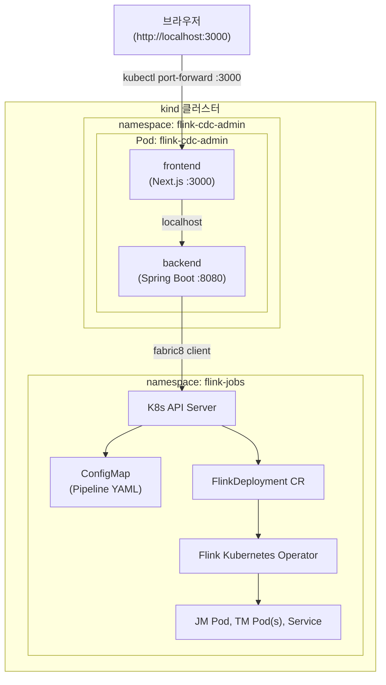

# Flink CDC Admin Tool – 통합 테스트 플랜

---

## 1. 개요

백엔드(Spring Boot)와 프론트엔드(Next.js)를 **하나의 Kubernetes Pod**에 배포하고, 같은 클러스터 내에서 Flink CDC 작업을 생성/조회/삭제하는 전체 흐름을 검증한다.

### 1.1 목표

- 백엔드 ↔ 프론트엔드 ↔ K8s API 간 통합 동작 검증
- ConfigMap + FlinkDeployment CR 생성/삭제 흐름 확인
- UI를 통한 전체 사용자 시나리오 검증
- RBAC 권한 정상 동작 확인

> **테스트 범위**: 이 테스트는 Admin Tool의 K8s 리소스 관리 기능(ConfigMap, FlinkDeployment CR의 생성/조회/삭제)을 검증한다. Flink CDC 파이프라인의 실제 실행(MySQL → Kafka 데이터 동기화 등)은 테스트 범위 밖이다. kind 클러스터에는 실제 소스/싱크 인프라가 없으므로, Job 상태는 DEPLOYING 이후 FAILED로 전이되는 것이 정상이다.

### 1.2 아키텍처



**핵심 포인트**: 같은 Pod 내 컨테이너는 `localhost`를 공유한다. 프론트엔드의 `next.config.ts`가 이미 `/api/*` 요청을 `localhost:8080`으로 프록시하므로, Pod 내에서 별도 설정 변경 없이 동작한다.

---

## 2. 사전 준비

### 2.1 필수 도구

| 도구 | 최소 버전 | 용도 |
|------|-----------|------|
| Docker | 24+ | 컨테이너 이미지 빌드 |
| kind | 0.20+ | 로컬 K8s 클러스터 |
| kubectl | 1.28+ | K8s 리소스 관리 |
| Helm | 3.12+ | Flink Operator 설치 |
| JDK | 21 | 백엔드 빌드 |
| Node.js | 20+ | 프론트엔드 빌드 |

### 2.2 설치 확인

```bash
docker version
kind version
kubectl version --client
helm version --short
java -version
node -v
```

---

## 3. Docker 이미지 빌드

### 3.1 백엔드 Dockerfile

`api/Dockerfile` 생성:

```dockerfile
# --- Build Stage ---
FROM eclipse-temurin:21-jdk AS build
WORKDIR /app

COPY gradle/ gradle/
COPY gradlew settings.gradle build.gradle ./
RUN ./gradlew dependencies --no-daemon || true

COPY src/ src/
RUN ./gradlew bootJar --no-daemon -x test

# --- Runtime Stage ---
FROM eclipse-temurin:21-jre
WORKDIR /app

COPY --from=build /app/build/libs/*.jar app.jar

EXPOSE 8080
ENTRYPOINT ["java", "-jar", "app.jar"]
```

### 3.2 프론트엔드 Dockerfile

`frontend/Dockerfile` 생성:

```dockerfile
# --- Build Stage ---
FROM node:20-alpine AS build
WORKDIR /app

COPY package.json package-lock.json ./
RUN npm ci

COPY . .
RUN npm run build

# --- Runtime Stage ---
FROM node:20-alpine
WORKDIR /app

COPY --from=build /app/.next/standalone ./
COPY --from=build /app/.next/static ./.next/static
COPY --from=build /app/public ./public

EXPOSE 3000
ENV HOSTNAME="0.0.0.0"
CMD ["node", "server.js"]
```

> **주의**: standalone 출력을 사용하려면 `next.config.ts`에 `output: "standalone"` 설정이 필요하다. (아래 3.3 참고)

### 3.3 프론트엔드 standalone 설정

`frontend/next.config.ts` 수정:

```typescript
import type { NextConfig } from "next";

const nextConfig: NextConfig = {
  output: "standalone",
  reactCompiler: true,
  async rewrites() {
    return [
      {
        source: "/api/:path*",
        destination: `http://localhost:8080/api/:path*`,
      },
    ];
  },
};

export default nextConfig;
```

### 3.4 이미지 빌드 및 kind 로드

```bash
# 프로젝트 루트에서 실행

# 백엔드 이미지 빌드
docker build -t flink-cdc-admin-backend:latest -f api/Dockerfile api/

# 프론트엔드 이미지 빌드
docker build -t flink-cdc-admin-frontend:latest -f frontend/Dockerfile frontend/

# kind 클러스터에 이미지 로드 (레지스트리 불필요)
kind load docker-image flink-cdc-admin-backend:latest --name flink-admin-test
kind load docker-image flink-cdc-admin-frontend:latest --name flink-admin-test
```

---

## 4. Kubernetes 클러스터 구성

### 4.1 kind 클러스터 생성

`deploy/kind-config.yaml`:

```yaml
apiVersion: kind.x-k8s.io/v1alpha4
kind: Cluster
name: flink-admin-test
nodes:
  - role: control-plane
  - role: worker
```

```bash
kind create cluster --config deploy/kind-config.yaml
kubectl cluster-info --context kind-flink-admin-test
```

### 4.2 네임스페이스 생성

```bash
# Admin App 네임스페이스
kubectl create namespace flink-cdc-admin

# Flink 작업 네임스페이스
kubectl create namespace flink-jobs
```

### 4.3 Flink Kubernetes Operator 설치

```bash
# cert-manager 설치 (Operator 의존성) - 버전 고정
kubectl apply -f https://github.com/cert-manager/cert-manager/releases/download/v1.17.1/cert-manager.yaml
kubectl wait --for=condition=Available deployment/cert-manager-webhook -n cert-manager --timeout=120s

# Flink Operator Helm 레포 추가
# 공식 URL. 접근 불가 시 Apache archive 사용: https://archive.apache.org/dist/flink/flink-kubernetes-operator-1.14.0/
helm repo add flink-operator https://downloads.apache.org/flink/flink-kubernetes-operator-1.14.0/
helm repo update

# Flink Operator 설치 (flink-jobs 네임스페이스 watch) - 버전 명시
helm install flink-kubernetes-operator flink-operator/flink-kubernetes-operator \
  --namespace flink-operator-system \
  --create-namespace \
  --set watchNamespaces="{flink-jobs}" \
  --version 1.14.0
```

설치 확인:

```bash
# Operator Pod 정상 동작 확인
kubectl get pods -n flink-operator-system

# FlinkDeployment CRD 등록 확인
kubectl get crd flinkdeployments.flink.apache.org
```

### 4.4 Flink 작업용 ServiceAccount 생성

`deploy/flink-service-account.yaml`:

```yaml
apiVersion: v1
kind: ServiceAccount
metadata:
  name: flink
  namespace: flink-jobs
---
apiVersion: rbac.authorization.k8s.io/v1
kind: Role
metadata:
  name: flink-role
  namespace: flink-jobs
rules:
  - apiGroups: [""]
    resources: ["pods", "configmaps", "services"]
    verbs: ["*"]
  - apiGroups: ["apps"]
    resources: ["deployments"]
    verbs: ["*"]
---
apiVersion: rbac.authorization.k8s.io/v1
kind: RoleBinding
metadata:
  name: flink-role-binding
  namespace: flink-jobs
subjects:
  - kind: ServiceAccount
    name: flink
roleRef:
  kind: Role
  name: flink-role
  apiGroup: rbac.authorization.k8s.io
```

```bash
kubectl apply -f deploy/flink-service-account.yaml
```

---

## 5. Admin App 배포

### 5.1 RBAC (Admin App용)

`deploy/admin-rbac.yaml`:

```yaml
apiVersion: v1
kind: ServiceAccount
metadata:
  name: flink-cdc-admin
  namespace: flink-cdc-admin
---
# flink-jobs 네임스페이스에서 FlinkDeployment + ConfigMap 관리 권한
apiVersion: rbac.authorization.k8s.io/v1
kind: Role
metadata:
  name: flink-cdc-admin-role
  namespace: flink-jobs
rules:
  # FlinkDeployment 관리
  - apiGroups: ["flink.apache.org"]
    resources: ["flinkdeployments"]
    verbs: ["get", "list", "watch", "create", "update", "patch", "delete"]
  - apiGroups: ["flink.apache.org"]
    resources: ["flinkdeployments/status"]
    verbs: ["get"]
  # ConfigMap 관리 (Pipeline YAML)
  - apiGroups: [""]
    resources: ["configmaps"]
    verbs: ["get", "list", "create", "update", "patch", "delete"]
  # Pod/Event 읽기 (상태 조회)
  - apiGroups: [""]
    resources: ["pods", "pods/log", "events"]
    verbs: ["get", "list", "watch"]
  # Service 읽기 (Flink UI 링크)
  - apiGroups: [""]
    resources: ["services"]
    verbs: ["get", "list"]
---
apiVersion: rbac.authorization.k8s.io/v1
kind: RoleBinding
metadata:
  name: flink-cdc-admin-binding
  namespace: flink-jobs
subjects:
  - kind: ServiceAccount
    name: flink-cdc-admin
    namespace: flink-cdc-admin
roleRef:
  kind: Role
  name: flink-cdc-admin-role
  apiGroup: rbac.authorization.k8s.io
```

```bash
kubectl apply -f deploy/admin-rbac.yaml
```

### 5.2 Deployment (단일 Pod, 2 컨테이너)

`deploy/admin-deployment.yaml`:

```yaml
apiVersion: apps/v1
kind: Deployment
metadata:
  name: flink-cdc-admin
  namespace: flink-cdc-admin
  labels:
    app: flink-cdc-admin
spec:
  replicas: 1
  selector:
    matchLabels:
      app: flink-cdc-admin
  template:
    metadata:
      labels:
        app: flink-cdc-admin
    spec:
      serviceAccountName: flink-cdc-admin
      containers:
        # --- Backend (Spring Boot) ---
        - name: backend
          image: flink-cdc-admin-backend:latest
          imagePullPolicy: Never  # kind에 직접 로드한 이미지 사용
          ports:
            - name: api
              containerPort: 8080
          env:
            - name: FLINK_CDC_ADMIN_KUBERNETES_NAMESPACE
              value: "flink-jobs"
          readinessProbe:
            httpGet:
              path: /swagger-ui.html
              port: 8080
            initialDelaySeconds: 15
            periodSeconds: 5
          livenessProbe:
            httpGet:
              path: /swagger-ui.html
              port: 8080
            initialDelaySeconds: 30
            periodSeconds: 10
          resources:
            requests:
              cpu: 250m
              memory: 512Mi
            limits:
              cpu: "1"
              memory: 1Gi

        # --- Frontend (Next.js) ---
        - name: frontend
          image: flink-cdc-admin-frontend:latest
          imagePullPolicy: Never
          ports:
            - name: web
              containerPort: 3000
          readinessProbe:
            httpGet:
              path: /
              port: 3000
            initialDelaySeconds: 5
            periodSeconds: 5
          livenessProbe:
            httpGet:
              path: /
              port: 3000
            initialDelaySeconds: 10
            periodSeconds: 10
          resources:
            requests:
              cpu: 100m
              memory: 128Mi
            limits:
              cpu: 500m
              memory: 256Mi
---
apiVersion: v1
kind: Service
metadata:
  name: flink-cdc-admin
  namespace: flink-cdc-admin
spec:
  selector:
    app: flink-cdc-admin
  ports:
    - name: web
      port: 3000
      targetPort: 3000
    - name: api
      port: 8080
      targetPort: 8080
```

```bash
kubectl apply -f deploy/admin-deployment.yaml
```

### 5.3 배포 확인

```bash
# Pod 상태 확인
kubectl get pods -n flink-cdc-admin -w

# 두 컨테이너 모두 Ready 확인 (2/2)
kubectl get pods -n flink-cdc-admin

# 로그 확인
kubectl logs -n flink-cdc-admin deploy/flink-cdc-admin -c backend
kubectl logs -n flink-cdc-admin deploy/flink-cdc-admin -c frontend
```

### 5.4 포트 포워딩

```bash
# 프론트엔드 접속용 (브라우저)
kubectl port-forward -n flink-cdc-admin svc/flink-cdc-admin 3000:3000

# 백엔드 API 직접 접근용 (디버깅)
kubectl port-forward -n flink-cdc-admin svc/flink-cdc-admin 8080:8080
```

접속:
- **Web UI**: http://localhost:3000
- **Swagger UI**: http://localhost:8080/swagger-ui.html
- **API**: http://localhost:8080/api/v1/jobs

---

## 6. 테스트 시나리오

### 6.1 시나리오 1: 작업 목록 조회 (빈 상태)

**목적**: 작업이 없을 때 빈 상태 UI가 올바르게 표시되는지 확인

**절차**:
1. 브라우저에서 http://localhost:3000 접속
2. "No jobs found" 빈 상태 메시지 확인
3. "Create Job" 버튼 표시 확인

**예상 결과**:
- 빈 상태 안내 문구와 "Create Job" 버튼이 보인다

**API 직접 확인**:
```bash
curl http://localhost:8080/api/v1/jobs
# 예상: []
```

---

### 6.2 시나리오 2: 작업 생성

**목적**: Pipeline YAML로 Flink CDC 작업을 생성하고 K8s 리소스가 올바르게 생성되는지 확인

**절차**:
1. "Create Job" 클릭 → `/jobs/new` 이동
2. 폼 입력:
   - **Job Name**: `test-mysql-to-kafka`
   - **Pipeline YAML**:
     ```yaml
     source:
       type: mysql
       name: mysql-source
       hostname: mysql.database.svc.cluster.local
       port: 3306
       username: root
       password: root
       tables: test_db.\*
       server-id: 5400-5404
     sink:
       type: kafka
       name: kafka-sink
       properties.bootstrap.servers: kafka.messaging.svc.cluster.local:9092
     pipeline:
       name: test-pipeline
       parallelism: 1
     ```
   - **Flink Image**: `flink:1.18`
   - **JobManager CPU**: 1, **Memory**: 1024m
   - **TaskManager CPU**: 1, **Memory**: 1024m, **Replicas**: 1
   - **Parallelism**: 1
3. "Create Job" 버튼 클릭
4. 상세 페이지로 이동 확인

**예상 결과**:
- 201 Created 응답
- 상세 페이지에서 Status: DEPLOYING 표시 → 이후 FAILED 전이 (kind 클러스터에 실제 MySQL/Kafka가 없으므로 정상)
- **핵심 검증 포인트**: ConfigMap과 FlinkDeployment CR이 올바르게 생성되었는가
- K8s 리소스 생성 확인:

```bash
# FlinkDeployment 생성 확인
kubectl get flinkdeployment -n flink-jobs
# 예상: test-mysql-to-kafka

# ConfigMap 생성 확인
kubectl get configmap -n flink-jobs
# 예상: test-mysql-to-kafka-pipeline

# Label 확인
kubectl get flinkdeployment test-mysql-to-kafka -n flink-jobs --show-labels
# 예상: app.kubernetes.io/managed-by=flink-cdc-admin

# ownerReferences 확인
kubectl get configmap test-mysql-to-kafka-pipeline -n flink-jobs -o jsonpath='{.metadata.ownerReferences}'
```

---

### 6.3 시나리오 3: 유효성 검증 오류

**목적**: 잘못된 입력에 대해 프론트엔드/백엔드 검증이 동작하는지 확인

**테스트 케이스**:

| 입력 | 예상 결과 |
|------|-----------|
| Job Name 비어있음 | 클라이언트 검증: "Job name is required." |
| Job Name: `INVALID_NAME` (대문자, 언더스코어) | 클라이언트 검증: 패턴 오류 |
| Pipeline YAML 비어있음 | 클라이언트 검증: "Pipeline YAML is required." |
| 동일 Job Name으로 재생성 | 409 Conflict: "Job 'xxx' already exists" |

**API 직접 확인**:
```bash
# 빈 요청
curl -X POST http://localhost:8080/api/v1/jobs \
  -H "Content-Type: application/json" \
  -d '{}'
# 예상: 400 Bad Request

# 중복 이름
curl -X POST http://localhost:8080/api/v1/jobs \
  -H "Content-Type: application/json" \
  -d '{"jobName":"test-mysql-to-kafka","pipelineYaml":"test","flinkImage":"flink:1.18"}'
# 예상: 409 Conflict
```

---

### 6.4 시나리오 4: 작업 목록 조회 (데이터 있음)

**목적**: 생성된 작업이 목록에 올바르게 표시되는지 확인

**절차**:
1. http://localhost:3000 접속
2. 테이블에 `test-mysql-to-kafka` 작업 표시 확인
3. Status 뱃지 확인 (DEPLOYING → FAILED)
4. 5초 폴링으로 상태 자동 갱신 확인

**예상 결과**:
- 작업 이름, 상태, 이미지, 병렬도, 생성 시각이 테이블에 표시
- 상태가 DEPLOYING → FAILED로 전이됨 (kind 클러스터에 실제 소스/싱크가 없으므로 정상)
- Flink Job 상태와 Admin Tool의 상태 표시가 일치하는지 확인
- 상태가 5초 폴링으로 자동 갱신됨

---

### 6.5 시나리오 5: 작업 상세 조회

**목적**: 상세 페이지의 모든 섹션이 올바르게 표시되는지 확인

**절차**:
1. 목록에서 `test-mysql-to-kafka` 클릭
2. 각 섹션 확인:
   - **Overview**: Namespace(flink-jobs), Image, Parallelism, Created At
   - **Resources**: JM/TM CPU, Memory, Replicas
   - **Kubernetes Status**: lifecycleState, jobManagerDeploymentStatus, jobStatus
   - **Pipeline YAML**: 원본 YAML 코드 블록 표시
   - **Events**: K8s 이벤트 목록

**예상 결과**:
- 모든 섹션에 데이터가 올바르게 표시
- Pipeline YAML이 원본 그대로 표시
- lifecycleState가 FAILED 상태 (kind 클러스터에 실제 소스/싱크가 없으므로 정상)
- Flink Job 상태와 Admin Tool의 상태 표시가 일치하는지 확인
- 5초 간격으로 상태 자동 갱신

**API 직접 확인**:
```bash
curl http://localhost:8080/api/v1/jobs/test-mysql-to-kafka | jq
```

---

### 6.6 시나리오 6: 작업 삭제

**목적**: 작업 삭제 시 FlinkDeployment + ConfigMap이 모두 정리되는지 확인

**절차**:
1. 상세 페이지 하단 "Danger Zone" → "Delete Job" 클릭
2. 확인 다이얼로그 승인
3. 목록 페이지로 이동 확인
4. 작업이 사라졌는지 확인

**예상 결과**:
- 목록에서 작업 제거됨
- K8s 리소스 정리 확인:

```bash
# FlinkDeployment 삭제 확인
kubectl get flinkdeployment -n flink-jobs
# 예상: No resources found

# ConfigMap 자동 삭제 확인 (ownerReferences에 의한 GC)
kubectl get configmap -n flink-jobs -l app.kubernetes.io/managed-by=flink-cdc-admin
# 예상: No resources found

# 관련 Pod 정리 확인
kubectl get pods -n flink-jobs
# 예상: Terminating → 최종적으로 없음
```

---

### 6.7 시나리오 7: 존재하지 않는 작업 조회

**목적**: 404 에러 처리 확인

**절차**:
1. 브라우저에서 http://localhost:3000/jobs/nonexistent-job 직접 접속

**예상 결과**:
- "Job Not Found" 에러 화면 표시
- "Back to Jobs" 링크 동작

---

## 7. 전체 실행 스크립트

모든 단계를 순서대로 실행하는 스크립트:

`deploy/setup.sh`:

```bash
#!/bin/bash
set -euo pipefail

echo "=== 1. kind 클러스터 생성 ==="
kind create cluster --config deploy/kind-config.yaml
echo ""

echo "=== 2. 네임스페이스 생성 ==="
kubectl create namespace flink-cdc-admin
kubectl create namespace flink-jobs
echo ""

echo "=== 3. cert-manager 설치 (v1.17.1) ==="
kubectl apply -f https://github.com/cert-manager/cert-manager/releases/download/v1.17.1/cert-manager.yaml
echo "cert-manager 준비 대기 중..."
kubectl wait --for=condition=Available deployment/cert-manager-webhook -n cert-manager --timeout=180s
echo ""

echo "=== 4. Flink Operator 설치 (v1.14.0) ==="
# 공식 URL. 접근 불가 시 Apache archive 사용: https://archive.apache.org/dist/flink/flink-kubernetes-operator-1.14.0/
helm repo add flink-operator https://downloads.apache.org/flink/flink-kubernetes-operator-1.14.0/ || true
helm repo update
helm install flink-kubernetes-operator flink-operator/flink-kubernetes-operator \
  --namespace flink-operator-system \
  --create-namespace \
  --set watchNamespaces="{flink-jobs}" \
  --version 1.14.0 \
  --wait --timeout 180s
echo ""

echo "=== 5. Flink ServiceAccount 생성 ==="
kubectl apply -f deploy/flink-service-account.yaml
echo ""

echo "=== 6. Docker 이미지 빌드 ==="
docker build -t flink-cdc-admin-backend:latest -f api/Dockerfile api/
docker build -t flink-cdc-admin-frontend:latest -f frontend/Dockerfile frontend/
echo ""

echo "=== 7. kind에 이미지 로드 ==="
kind load docker-image flink-cdc-admin-backend:latest --name flink-admin-test
kind load docker-image flink-cdc-admin-frontend:latest --name flink-admin-test
echo ""

echo "=== 8. Admin App RBAC + 배포 ==="
kubectl apply -f deploy/admin-rbac.yaml
kubectl apply -f deploy/admin-deployment.yaml
echo ""

echo "=== 9. 배포 완료 대기 ==="
kubectl wait --for=condition=Available deployment/flink-cdc-admin -n flink-cdc-admin --timeout=120s
echo ""

echo "=== 완료 ==="
echo "포트 포워딩 시작:"
echo "  kubectl port-forward -n flink-cdc-admin svc/flink-cdc-admin 3000:3000"
echo ""
echo "접속:"
echo "  Web UI:     http://localhost:3000"
echo "  Swagger UI: http://localhost:8080/swagger-ui.html"
```

---

## 8. 정리

```bash
# 클러스터 전체 삭제 (모든 리소스 포함)
kind delete cluster --name flink-admin-test
```

---

## 9. 체크리스트

### 배포 전

- [ ] Docker 설치 및 실행 중
- [ ] kind, kubectl, helm 설치됨
- [ ] JDK 21, Node.js 20+ 설치됨
- [ ] `frontend/next.config.ts`에 `output: "standalone"` 추가됨

### 배포 확인

- [ ] kind 클러스터 생성 완료
- [ ] Flink Operator Pod Running
- [ ] FlinkDeployment CRD 등록됨
- [ ] Admin App Pod 2/2 Ready
- [ ] 포트 포워딩으로 UI 접속 가능

### 기능 테스트

- [ ] **시나리오 1**: 빈 목록 조회 정상
- [ ] **시나리오 2**: 작업 생성 → ConfigMap + FlinkDeployment 생성됨
- [ ] **시나리오 3**: 유효성 검증 오류 정상 처리
- [ ] **시나리오 4**: 목록에 작업 표시, 폴링 갱신 동작
- [ ] **시나리오 5**: 상세 정보 모든 섹션 표시
- [ ] **시나리오 6**: 삭제 → K8s 리소스 완전 정리
- [ ] **시나리오 7**: 404 에러 처리 정상

---

## 10. 트러블슈팅

### Pod가 시작되지 않을 때

```bash
# 이벤트 확인
kubectl describe pod -n flink-cdc-admin -l app=flink-cdc-admin

# 컨테이너별 로그
kubectl logs -n flink-cdc-admin deploy/flink-cdc-admin -c backend
kubectl logs -n flink-cdc-admin deploy/flink-cdc-admin -c frontend
```

### 백엔드에서 K8s API 접근 실패

```bash
# RBAC 권한 확인
kubectl auth can-i create flinkdeployments.flink.apache.org \
  --as=system:serviceaccount:flink-cdc-admin:flink-cdc-admin \
  -n flink-jobs
# 예상: yes

kubectl auth can-i create configmaps \
  --as=system:serviceaccount:flink-cdc-admin:flink-cdc-admin \
  -n flink-jobs
# 예상: yes
```

### FlinkDeployment가 생성되지만 Pod가 안 뜰 때

```bash
# Operator 로그 확인
kubectl logs -n flink-operator-system deploy/flink-kubernetes-operator

# FlinkDeployment 상태 확인
kubectl describe flinkdeployment -n flink-jobs

# Flink ServiceAccount 권한 확인
kubectl auth can-i create pods \
  --as=system:serviceaccount:flink-jobs:flink \
  -n flink-jobs
```

### 프론트엔드에서 API 호출 실패

```bash
# 프론트엔드 컨테이너에서 백엔드 접근 확인
kubectl exec -n flink-cdc-admin deploy/flink-cdc-admin -c frontend -- \
  wget -qO- http://localhost:8080/api/v1/jobs

# 백엔드 헬스 확인
kubectl exec -n flink-cdc-admin deploy/flink-cdc-admin -c frontend -- \
  wget -qO- http://localhost:8080/swagger-ui.html
```
